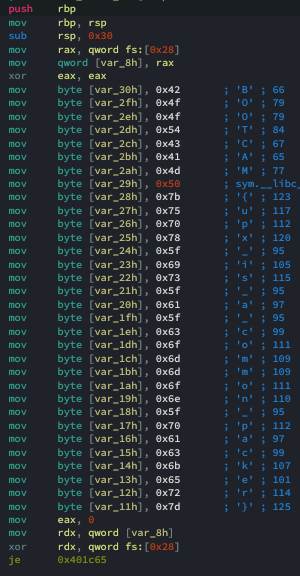

# RE2

If we try to run strings on the binary like we did in part 1, you might notice the "UPX!" strings at the bottom.

```
$ strings ./re2
...
w;f_
Cb/m
Xl(H
UPX!
UPX!
"4 (
...
```

If we scroll up a bit, we'll see:

```
$Info: This file is packed with the UPX executable packer http://upx.sf.net $
$Id: UPX 3.95 Copyright (C) 1996-2018 the UPX Team. All Rights Reserved. $
```

After a quick search on Google we can find the following information:

From "[UPX](https://en.wikipedia.org/wiki/UPX)":

> UPX (Ultimate Packer for Executables) is an open source executable packer supporting a number of file formats from different operating systems.

From "[Executable Compression](https://en.wikipedia.org/wiki/Executable_compression)":

> Executable compression is any means of compressing an executable file and combining the compressed data with decompression code into a single executable.

It's not clear that our first step should be unpacking the executable using UPX, similar to analyzing a file that's been compressed into a zip file.

```
$ upx -d re2
                       Ultimate Packer for eXecutables
                          Copyright (C) 1996 - 2018
UPX 3.95        Markus Oberhumer, Laszlo Molnar & John Reiser   Aug 26th 2018

        File size         Ratio      Format      Name
   --------------------   ------   -----------   -----------
    732472 <-    315120   43.02%   linux/i386    re2

Unpacked 1 file.
```

If we run re2, nothing appears to happen. Let's examine it in a reverse engineering platform like Cutter:


